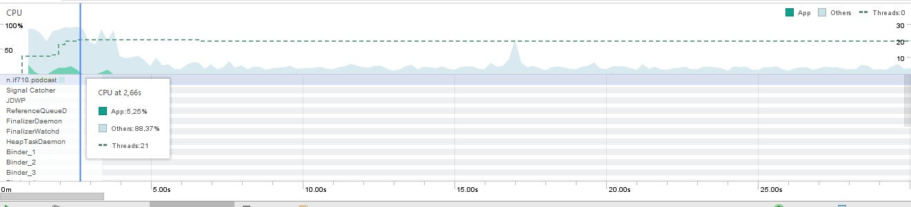
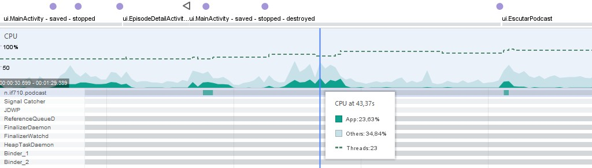
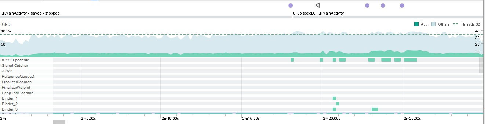
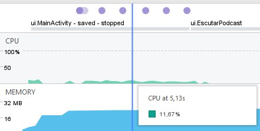

# CPU

## Android Profiler

Android do aparelho: 6.0

Temos os seguintes cenários para valores máximos atingidos:

+ Cenário de scroll na lista de feed, clicar em um título para ir para EpisodeDetailsActivity e voltar para baixar um episódio
  
  - Logo que o aplicativo abre, há um elevado uso de CPU por parte de outras aplicações, enquanto o Podcast não ultrapassa os 20%, mas aos 5 segundos, de acordo com o gráfico, o uso dos outros aplicativos cai para aproximadamente 30% enquanto o uso de CPU por parte do Podcast cai para 0. O pico de uso do app (23%) ocorre no download do episódio, e próximo desta porcentagem, ao clicar no botão 'Escutar' e abrir a activity que toca o episódio. Com isto, não foi percebido nenhum uso abusivo de CPU e não houve interferência de desempenho tanto no app quanto no restante dos processos que estavam rodando simultaneamente.
  
  

+ Cenário de troca de feed via SharedPreference e 4 downloads simultâneos, além de ir novamente para EpisodeDetailsActivity e dar scroll na lista  
  
  - Já neste caso, o uso de CPU mostrou-se constante enquanto os downloads dos episódios eram feitos, e mesmo colocando um deles para tocar, não houve grandes mudanças/oscilações no uso de CPU, ficando entre 20 e 30% e não mais do que isso. 
  

+ Cenário ouvindo episódio até o final com a tela na activity EscutarPodcast (até o celular bloquear a tela após 2min):   
  - O uso da CPU só se mostra presente ao iniciar o app, como esperado, e ao dar scroll na lista do feed até apertar o botão de 'Escutar', a porcentagem fica entre 10 e 12%, depois disso estabiliza em 0%. Não foi apresentado uso de CPU por outros processos/aplicativos. 
  
  