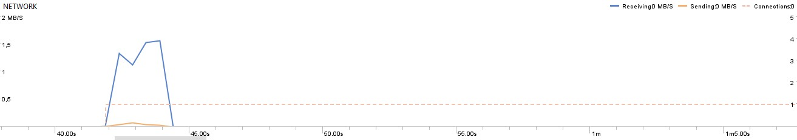
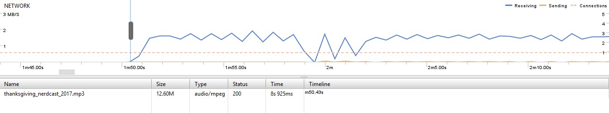
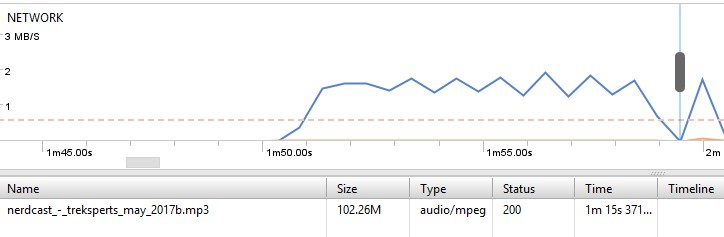
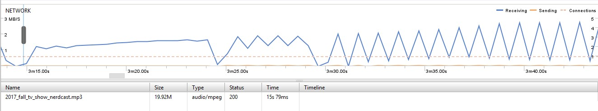

# Network

## Android Profiler

Android do aparelho: 6.0

Temos os seguintes cenários para valores máximos atingidos:

+ Baixando um episódio somente e tendo a lista de feed já setada, a taxa de envio máxima chegou em 0,07mb/s aos 42,94s. Aos 43,90s, a taxa de recebimento máxima foi de 1,52mb/s (dentro do esperado para a velocidade da internet usada durante o monitoramento, sem causar algum possível gargalo)

+ Cenário de troca de feed, 4 episódios para baixar e navegação pelo app indo para EpisodeDetailsActivity e dando scroll na lista: Apesar de ser usado um Service para fazer o download dos episódios, o download ocorreu sequencialmente, ou seja, foi baixando 1 por 1, por mais que o intervalo de tempo ao apertar os botões tenha sido bastante curto (o suficiente para induzir que seriam baixados os arquivos todos ao mesmo tempo). O maior valor na taxa de recebimento foi de 2,93mb/s, havendo um comportamento de subidas e decidas em espaços curtos de tempo (em questão de centésimo de segundos) ao baixar o quarto episódio. 

